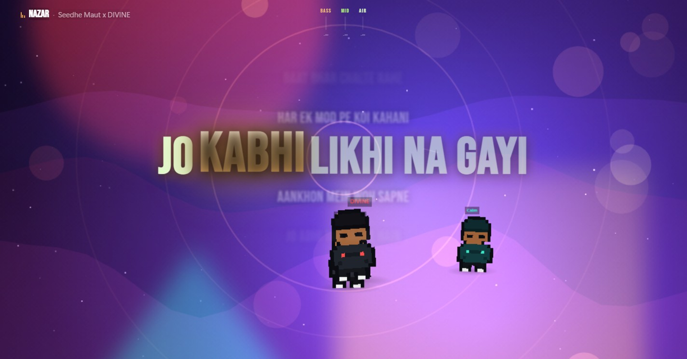
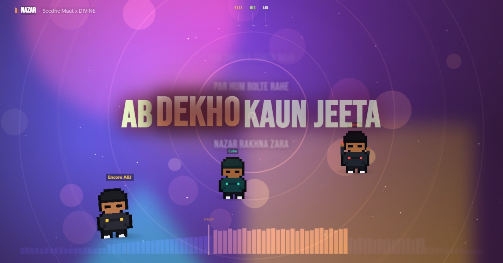
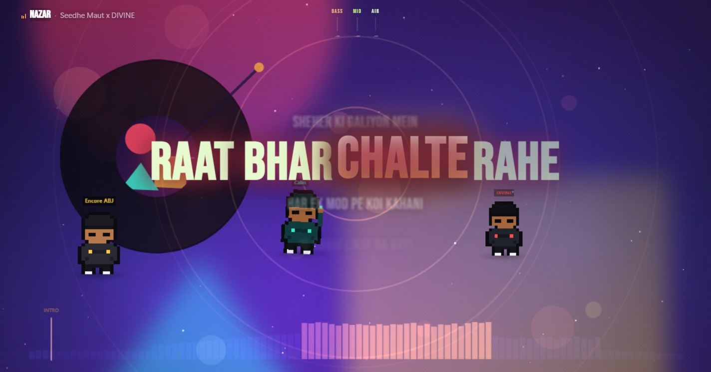
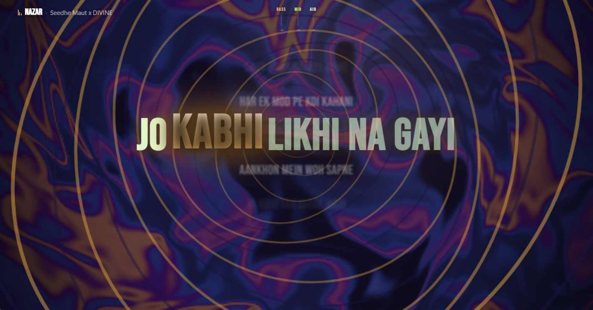
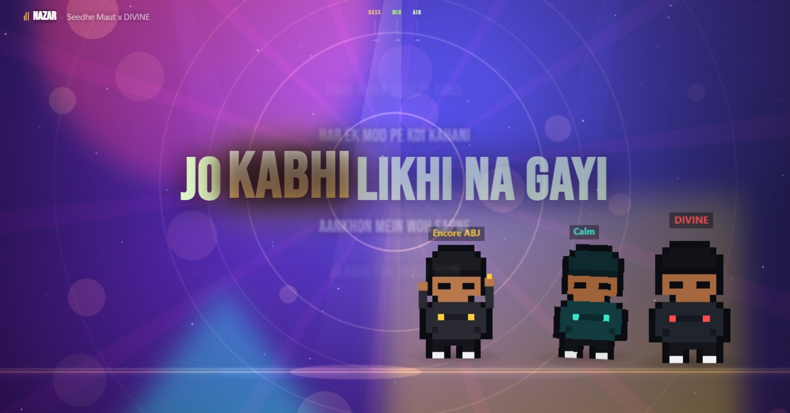
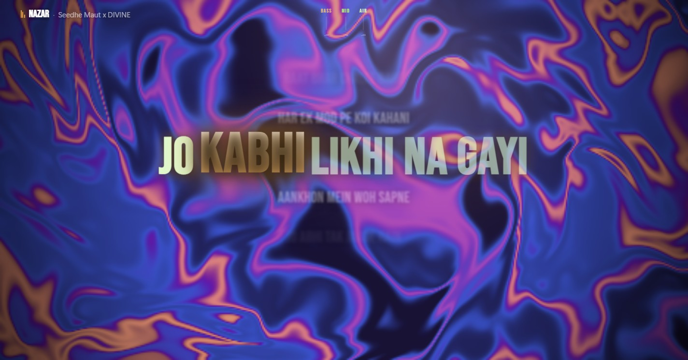
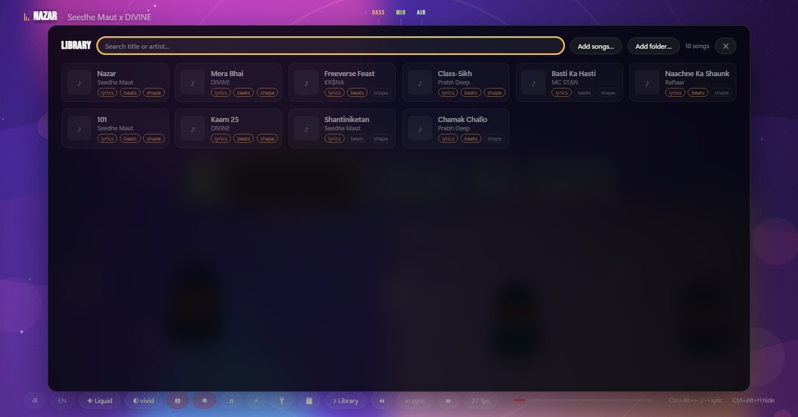

# Lyric Player

A fullscreen synced lyric player for Windows. Detects whatever is playing —
Spotify desktop, YouTube Music in a browser, anything that registers with
Windows — and shows beat-aware lyrics fullscreen, so you never look at the
music video or the Spotify UI. Or open your own files and let it play them.



## Looks

Each song picks its own look, and you can pin one to a track. Nine presets; a
few of them:

| | |
| --- | --- |
|  | **Heatmap** — the shape of the song along the bottom edge, learned by listening and remembered. On a replay the drop is on screen while the build-up is still playing. |
|  | **Vinyl** — the cover art as a record on a deck, turning one revolution every four beats once the tempo locks. The tonearm creeps inward as the song plays. |
|  | **Wormhole** — a twisting tunnel flying toward you. It constricts and winds up in the seconds *before* a drop it already knows is coming. |
|  | **Stage** — the artist dancers as the subject: a lit floor, spotlights that punch on the kick, the troupe pushed forward. |
|  | **Ghost** — lyrics and the cloud, nothing else. The 2D canvas leaves the page entirely, cutting CPU rendering by ~95%. For reading the words, or running over a game. |

## Your songs



Every song the app has seen, with what it knows about each: lyrics cached, beat
map learned, energy arc learned. Add files or a folder from disk and it plays
them itself — which is also when the app is at its best, because it can measure
a whole track before the first chorus.

## Status

The full spine works: detection → lyric lookup → synced fullscreen player, with
a Latin/Devanagari script toggle and English translation for Hindi tracks. The
audio-reactive system is built — measured tempo, kick and drop detection,
learned per-song energy maps, word-level sync, and dancing artist sprites. Local
file playback landed in 0.18.0.

0.37.0 moved the heavy work off the UI: background jobs run through one
scheduler instead of five loose threads, speech recognition runs in its own
native process (every core, rather than the single thread a browser engine
allowed), and a local file is measured before its first chorus — real tempo and
beat positions, key, section boundaries, mastering loudness. See
[`docs/JOB-ENGINE.md`](docs/JOB-ENGINE.md) for the design and the reasoning.

## How it works

```
SMTC (Windows)  ──►  smtc-poll.ps1  ──►  Rust (lib.rs)  ──►  webview renderer
 any media app        JSON stream        staleness-          lyric matching,
                                         corrected pos        fullscreen word emphasis

local file      ──►  read + decode  ──►  Rust (lib.rs)  ──►  renderer ──► analyze.js
 your library         (symphonia)        same pipeline        plays it    whole song
                                                                          measured up front
```

The app is a Tauri shell: Rust owns the window, SMTC polling, lyric/artwork
lookups, the LLM calls and local-file decode; the webview (WebView2) renders
everything you see, same as before. There is no Node/Electron process at
runtime — `node`/`npm` are only needed to develop and build it.

- **Detection** uses the Windows System Media Transport Controls (SMTC). One API
  covers every media app and gives title, artist, playback status, and position.
- **Lyrics** come from [LRCLIB](https://lrclib.net) — free, open, no API key.
- **Sync** interpolates locally between SMTC samples, so word emphasis stays
  fluid. A local file skips that entirely — position comes from the audio
  element, which is exact.
- **Local files** go through the same lyric/artwork/cache pipeline, so nothing
  downstream needs to know where a song came from.

## Requirements

- Windows 10/11 (macOS/Linux build and run too, minus the Windows-only bits —
  SMTC now-playing detection, wallpaper mode, WASAPI capture — see
  `.github/workflows/release.yml`)
- Node.js 18+ and the [Rust toolchain](https://rustup.rs/) (stable)

**No PowerShell requirement any more.** Up to 0.34.0 this section demanded
Windows PowerShell 5.1, because now-playing detection ran in a long-lived
`powershell.exe` child that streamed JSON over a pipe — and PowerShell 7
removed the WinRT type projection that script depended on, so 5.1 specifically
was load-bearing. 0.35.0 replaced the whole thing with the WinRT API called
directly from Rust (`src-tauri/src/smtc.rs`), which also returned the ~92MB
that child process cost. `smtc-poll.ps1` survives only as a debugging probe
(`npm run probe`).

## Run

```sh
npm install
npm run tauri:dev
```

Diagnose SMTC detection on its own (prints one sample as JSON):

```sh
npm run probe
```

## Build a desktop app

```sh
npm run tauri:build
```

Produces a signed-by-updater (not Authenticode-signed — see
`.github/workflows/release.yml`) NSIS installer under
`src-tauri/target/release/bundle/nsis/`. Tagged pushes (`v*`) build and publish
this automatically for Windows, macOS and Linux via GitHub Actions.

## Performance

The backdrop is the main cost, so it's tuned to stay smooth:
- Canvas DPR is capped at 1.0 (a 1:1 canvas on 4K is the biggest lag source),
  and both canvases have a **resolution ladder** that sheds pixels when frames
  run long and earns them back when there is headroom.
- Colour glows, the vinyl platter, the song timeline and the dancers' name
  plates and shadows are all **pre-rendered sprites** drawn with `drawImage`,
  not rebuilt every frame.
- Gradients are cached and rebuilt only on resize or a colour change — and keyed
  on a *snapped* hue, because the live accent drifts every frame and would
  otherwise invalidate the cache constantly.
- Star count is bounded; lyric lines don't use `will-change` (fewer GPU layers).

Optimise against **CPU cost measured with a profiler**, never against observed
frame rate: repeated identical runs vary 3–4× in fps on this hardware, and a
draw-call count once ranked the wrong thing entirely (the galaxy's real expense
was a colour conversion per particle, not a canvas call).

## Controls

| Input | Action |
|---|---|
| `Ctrl+Alt+←` / `Ctrl+Alt+→` | Nudge lyric sync 100ms earlier / later |
| `Ctrl+Alt+0` | Reset sync offset |
| `Ctrl+Alt+H` | Show / hide the player |
| `Ctrl+Alt+M` | Toggle wallpaper mode — works even if the window isn't currently clickable |
| Move the mouse | Reveal the bottom control bar (auto-hides after 2.5s) |
| `अ` chip | Toggle Latin / Devanagari script |
| `EN` chip | Toggle English translation line |
| `◈` chip | Cycle the visual preset: Ghost → Heatmap → Vinyl → Stage → Wormhole → Liquid → Starfield → Geometry → Concert → Minimal (persisted per song) |
| `◐` chip | Cycle backdrop opacity: faint → tinted → vivid → solid (persisted) |
| `🅰` chip | Show / hide the lyric text — the backdrop keeps running as a pure visualiser |
| `☻` chip | Toggle the pixel-art artist dancers (persisted) |
| `♪ Library` chip | Your songs — search, see what is known about each, add files from disk, click to play |
| `♫` chip | Audio-reactive mode (captures system sound) — also what lets the app *learn* a song |
| `⚡` chip | Lite mode — fewer effects, higher frame rate |
| `✳` chip | Browse the **1754 MilkDrop presets** by their pictures — like one, hide one, pin one to a song |
| `▣` chip | Cover art — pick a different one when the search got it wrong |
| `🖥 Wallpaper` chip | Toggle between fullscreen and desktop-wallpaper mode |

**Wallpaper mode.** Renders *behind* your desktop icons instead of over
everything, so the app is simply on rather than something you launch. It stays
interactive: a window parented into the desktop gets no mouse input from
Windows at all, so the pointer is forwarded, and any panel that needs to
scroll or take focus briefly lifts the window to the foreground while it's open.

**MilkDrop presets (`✳` chip).** 1754 of them, from the Butterchurn/MilkDrop
ecosystem. Names written by strangers in 2003 tell you nothing about what a
preset looks like, so the browser renders a preview of each one — by the engine
itself, cached, and only for what you scroll to. Like the ones you want to keep,
hide the ones you never want to see again (hidden ones leave the dice and the
beat-synced cycle too), and step through with the arrow keys, watching rather
than reading. The swirl field stays the default and stays the identity: it times
itself to lyric density, which no MilkDrop preset does or can.

**Visual presets (`◈` chip).** Each is a deliberate look with a stated cost,
rather than a random shuffle of layers:

| Preset | What it is |
|---|---|
| **Ghost** | Lyrics and the cloud, nothing else. No stars, dancers, confetti or curves — the 2D canvas is removed from the page entirely, which cuts the CPU rendering work by ~95%. Pick this to read the words, or to run over a game or a call. |
| **Heatmap** | The shape of the song as a timeline along the bottom edge, learned by listening and remembered. On a replay the drop is on screen while the build-up is still playing. |
| **Vinyl** | The cover art as a record on a deck, turning the whole time — one revolution every four beats once the tempo has locked. The tonearm creeps inward as the song plays. |
| **Stage** | The dancers as the subject: a lit floor, spotlights that punch on the kick, and the troupe pushed forward. A drop fills the stage with clones. |
| **Wormhole** | A twisting tunnel flying toward you, rings accelerating out of a vanishing point behind the lyric. Constricts and winds up in the seconds *before* a drop it already knows is coming. |
| **Liquid** | The signature look: the GPU field carries it, only the softest 2D layers stay on. Default. |
| **Starfield** | Depth and drift — galaxy plus constellation web. |
| **Geometry** | The parametric curves are the subject; the field calms to a backdrop. |
| **Concert** | Everything on. The loud one, for drops and parties. |
| **Minimal** | The performance fallback the governor drops to, not an aesthetic. |

Each song remembers its own look. Ghost and Minimal are never assigned at
random — they are modes you choose.

Heatmap, Vinyl and Stage are ordinary layer combinations, so the pieces compose:
the timeline is on in Vinyl too, and the dancers appear in every look except the
two stripped-back ones.

Those two are the exceptions, and they differ from each other. **Ghost** removes
the 2D canvas from the page entirely — that is the whole point of it, and it is
why nothing can be drawn in Ghost. **Wormhole** keeps the canvas, because it has
a picture, but suppresses every always-on extra so only the tunnel and the words
remain.

Most of what the app *learns* — the energy arc behind the timelines, the
measured tempo the platter and the dancers run on, and anticipation — needs the
`♫` chip. The app asks about this once, twenty seconds into a song, and never
raises it again either way. It is not enabled by default on purpose: recording
system audio without being asked is not the app's call.

**...unless you play the song here.** Open files or a folder from the Library and
the app plays them itself, which changes everything about the above: the decoded
audio is already in hand, so the whole track is measured before the first
chorus. The timeline is full, the tempo is locked and a drop can be anticipated
**on the first play**, with no capture and no permission prompt. Position also
comes from the audio element rather than a 250ms poll, so the lyric clock is
exact.

**Anticipation.** Once a song's heat map is on disk, the app can read it
*forwards* — the only thing here that knows what has not happened yet. A few
seconds before a drop the field tightens and the dancers gather and coil, so the
hit lands on a screen that was already leaning into it. Songs that have not been
heard get none of this rather than a guess.

The window is a **transparent, borderless, fullscreen-sized** surface that floats
over the desktop (always-on-top). Transparency is why it's borderless-fullscreen
rather than true OS fullscreen — transparent + true-fullscreen is unreliable on
Windows.

**Backdrop opacity (`◐` chip).** A fully transparent overlay makes the colour
wash nearly invisible over the desktop, so the backdrop has four levels — *faint*
(barely there), *tinted*, *vivid* (default), *solid* (opaque). The choice is
saved in `localStorage`. A drop flash punches through at any level, so colour
change always reads.

**Sync offsets are saved per track.** SMTC's reported position drifts from actual
audio by roughly 100–500ms depending on the source app and audio stack. The same
track tends to need the same correction, so once you dial it in, it sticks — stored
in `settings.json` under `%APPDATA%\com.dhruv.lyricoverlay\`.

Timestamp accuracy is also improved at the source: the poller reports how *old* each
position reading is (`stalenessMs`), and the Rust backend projects forward from that
rather than trusting a value that may be seconds stale.

## Hindi / Punjabi

### Devanagari script toggle (`अ` chip)

Most Indian hip-hop on LRCLIB is stored **romanized** — a verified Seedhe Maut
sample came back as `"Itna roliye ab gaane sunke rona bhi ni aata"`. The script
toggle handles this native-first:

1. **Native Devanagari entry** — if LRCLIB has a Devanagari-script version, it's
   used directly. Verified: `नalla Freestyle` (85 lines) and `Mere Gully Mein`
   (86 lines) both have native entries. Instant, offline.
2. **Transliteration fallback** — for tracks with only a romanized entry (e.g.
   Seedhe Maut's `101`), the romanized lyrics are converted to Devanagari on
   demand via the configured LLM. **Transliteration, not translation** — words and
   order preserved exactly, only the script changes.

Devanagari renders with **Nirmala UI**, which ships with Windows.

### English translation line (`EN` chip)

A second, italic line beneath the running lyric shows the **English translation**.
It auto-appears for tracks detected as Hindi or Punjabi (romanized or native
script); English songs are correctly skipped so no API call is wasted. Toggle
it on any track with the `EN` chip.

This is **translation** (meaning), distinct from the Devanagari toggle
(transliteration / script).

## LLM provider (for transliteration & translation)

These two features call an LLM. The provider is **pluggable** and chosen by which
credential is present — no code change, no hardcoded keys:

| Env var | Provider | Notes |
|---|---|---|
| `GEMINI_API_KEY` (or `GOOGLE_API_KEY`) | Google Gemini | Free tier is plenty for this — one call per new song, cached |
| `GROQ_API_KEY` | Groq | OpenAI-compatible, tried if Gemini isn't configured |
| `HF_API_KEY` (or `HUGGINGFACE_API_KEY`/`HF_TOKEN`) | HuggingFace router | Needs the "Make calls to Inference Providers" token scope |
| *(a local CLI, via the 🔑 panel's "Local AI" picker)* | Claude / Gemini / Ollama / `gh models` / Antigravity CLI | Last resort, tried only once you've explicitly opted in — spends your own machine/tokens |
| *(none of the above)* | — | Features are simply unavailable; lyrics still work |

Keys can also be pasted into the in-app 🔑 panel instead of set as env vars —
set once, no rebuild needed. Precedence is Gemini → Groq → HuggingFace → local
CLI; override with `LYRIC_OVERLAY_PROVIDER=gemini|groq|huggingface`. **Never
commit a key.** If you have ever pasted a key into a chat or file, rotate it.

Results are cached per song, so each track costs at most one transliteration and
one translation call for its whole lifetime in the cache.

## Design notes

**Word-level timing is real where a transcription anchored it, interpolated
everywhere else.** This note used to say "interpolated, not real" flatly, and
that stopped being true in 0.37.0.

LRCLIB still provides line-level timestamps only, and true word-level (A2)
timing still exists essentially only in Musixmatch's paid "richsync" data. But
the app measures its own: the native Whisper decoder produces per-word
timestamps from its cross-attention weights (DTW, `src-tauri/sidecar/src/dtw.rs`),
and `align::attach_word_timings` grafts those onto the *real* lyric text
whenever a line's word count matches what Whisper heard for it. Lines it cannot
anchor keep the estimate — `buildWordTimings()` in `src/renderer/renderer.js`,
distributing the line's duration across its words weighted by word length.

That split is deliberate and visible in the data: a cue carries a `words` array
only when the timing was measured. A mishearing that merges or splits words
leaves the line on the estimate rather than moving the words to confidently
wrong places.

Worth knowing if you are reading old notes: **the WebView path this originally
described had never actually produced word timing at all.** It named an ONNX
export with no cross-attention output, so the request for word timestamps threw
and took the whole transcription with it. Fixed in 0.37.0.

**Titles are noisy and need cleaning on both sides.** Browser sessions report raw
video titles. A verified live sample:

```
"'नalla' Freestyle (Visualizer) | Seedhe Maut x DJ SA"  →  "नalla Freestyle"
```

LRCLIB's own entries are messy too (`"11K - Seedhe Maut"`, `"Hausla - Seedhe Maut"`),
so `scoreCandidate()` compares against both the track name and a combined
track+artist string, then ranks by duration proximity.

**Use LRCLIB's free-text `q=` endpoint.** The structured `track_name`/`artist_name`
endpoint was measured returning zero results for tracks that free-text search
matched successfully.

**Lyrics are never generated.** If no synced match is found, the overlay says so.
Asking an LLM to invent lyrics for an unknown song produces confident, wrong words.
The only legitimate path for uncovered tracks is transcription from actual audio.

## Visual design

- **Apple Music-style scrolling column.** All lines live in a column that slides
  up so the active line stays near center. Lines **fade with distance** (opacity
  falls off ~3 lines out) so they never hard-cut at the screen edge — the earlier
  single-line crossfade looked like it was being clipped.
- **Adaptive scroll timing.** The push-up duration adapts to lyric speed: fast
  lines scroll up quickly (~150ms), slow lines glide (~460ms). Derived from the
  gap to the next cue.
- **Word focus.** The word being sung is coloured with the track accent, scaled
  up, and capitalized (Latin only). Word spacing uses `margin`, not text-node
  spaces, so scaling/uppercasing never jitters the line.
- **Auto font size on intense moments.** The active line scales up (~1.35× →
  ~2.2×) based on **lyric cadence** — words per second. Fast, dense bars
  ("top barks") auto-enlarge; sparse lines shrink.
- **Confined view.** Only ~3 lines show: the active line (bright, centered), one
  clear line above and below, and a faint hint at ±2. Everything else is hidden.
- **Permanent 80% container.** Lyrics live in the middle 80vw (10vw padding each
  side). Long lines wrap inside that box, and the active-line auto-enlarge is
  capped by line length (short punchy lines hit ~2×, long lines stay ~1.3×) so a
  big lyric never spills off screen.
- **Gradient word highlight.** The word being sung is filled with a white→accent
  vertical gradient (via background-clip text) with drop-shadow glow.
- **Sentiment-driven graphics.** When an LLM key is set, the song's lyrics are
  analyzed for **mood** (e.g. melancholic, euphoric, aggressive) which sets the
  hue, saturation, and a baseline **energy** — high-energy songs keep the glows
  and stars moving faster and brighter, mellow songs slow everything down. The
  mood word shows top-right. Falls back to a per-track hash palette with no key.
  Verified: melancholic → blue, calm energy → slower motion.
- **Starfield, always moving.** Twinkling drifting stars + occasional shooting
  stars over the tinted base. The colour glows drift *and* orbit continuously, so
  the scene is never frozen even within one song.
- **Build-up & drop "moments."** A lyric arriving after a long instrumental gap
  (> 5s of silence) is treated as a **drop**: the screen floods with the accent
  colour, a white core spikes at the peak, a shockwave ring expands, the hue
  rotates, and the stage physically shakes. In the final ~3.5s before that lyric
  lands, a **build-up** ramps — an accent bloom swells at centre and the glows
  speed up. This is inferred from lyric timing (no audio capture yet), so it fires
  on the *lyrical* drops that LRCLIB's line timing exposes.
- **Varied text moments.** Each active line picks a different per-word entrance —
  *wave* (cascade up), *pop* (scale-in), *blur* (defocus-in), or *glitch* (skew
  flicker) — cycling so it never feels repetitive; energetic bars bias to the
  punchier styles. Words stagger in with a 45ms step.
- **Pixel-art artist dancers (`☻` chip).** The reported artist is matched against
  a small registry (e.g. **Seedhe Maut** → a two-dancer duo, one warm/gold, one
  cool/teal); anyone unmatched gets a deterministic procedural dancer seeded from
  their name. The chibi characters bob, sway, fist-pump, spin, and **jump on the
  drop**, drawn as pixel art on the backdrop canvas. See `src/renderer/sprites.js`
  — the registry is one array; add a `{ match, label, members }` entry to brand a
  new artist.
- **Never goes static.** The render loop stays at full speed even when the
  overlay isn't the focused window (e.g. while Spotify is in front) — Chromium
  otherwise throttles background windows to near-zero FPS. Both render loops
  are also wrapped so an error can't freeze them.

## Reactive visuals

The backdrop reacts to real audio now, not just lyric timing: native WASAPI
loopback capture (`♫` chip) feeds a measured tempo, kick/drop detection, and a
learned per-song energy map, so build-ups and drops land on actual instrumental
hits — including EDM tracks with no lyrics for a cadence heuristic to read.
Local file playback measures the whole track up front instead, so this all
works from the first play with no capture and no permission prompt.

## Not built yet

- Vocal isolation before transcription is shipped but experimental/unverified
  (see the 🔑 panel) — aimed at fast rap and dense EDM mixes where Whisper's
  transcription accuracy drops the most
- Word-level sync (not just line-level) for tracks that already have synced
  lyrics from LRCLIB, rather than only ones that went through transcription
- Genre-aware theming (EDM vs hip-hop) driven by actual audio, not just palette
