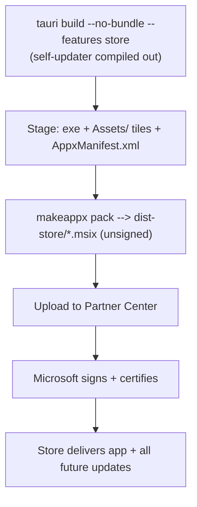

# Publishing to the Microsoft Store

Lyric Overlay ships to the Microsoft Store as an **MSIX** package. The Store
signs the package on ingestion and delivers updates, so this channel needs **no
code-signing certificate** and **no self-updater** — unlike the standalone
GitHub/NSIS build (see [SIGNING.md](SIGNING.md)).

Both channels coexist: the GitHub release stays for direct downloads and keeps
its self-updater; the Store build is a separate, read-only package.

## Product identity

These come from **Partner Center → Lyric Overlay → Product management → Product
identity** and are hard-coded in `src-tauri/msix/AppxManifest.xml`. They must
match exactly or the upload is rejected.

| Field | Value |
| --- | --- |
| Package/Identity Name | `DhruvChoudhary.LyricOverlay` |
| Publisher | `CN=96AC782F-5C01-4FEE-9316-A7B17837CEE4` |
| Publisher display name | `Dhruv Choudhary` |
| Package Family Name | `DhruvChoudhary.LyricOverlay_4mtjdpgtnw7ng` |

## How it works



The `store` Cargo feature (`src-tauri/Cargo.toml`) drops the
`tauri-plugin-updater` plugin. The app's update checks are already guarded by
`app.updater()`, so with the plugin absent they become silent no-ops — a
packaged app is read-only and can't self-replace, so the Store owns updates.

## Build the package

Locally (Windows, needs the Windows 10/11 SDK for `makeappx`):

```powershell
npm run icon        # only if the logo changed — regenerates the tiles
./scripts/build-msix.ps1
# -> dist-store/Lyric-Overlay-<version>.msix  (unsigned, ready to upload)
```

Or in CI: the **store-msix** workflow now runs on the same `v*` tag as the
GitHub release — one tag builds both channels. `workflow_dispatch` and
`store-v*` tags still work too, for a one-off rebuild without a new version.
It always uploads the `.msix` as a build artifact; see "Automated
submission" below for what happens after that.

### Version numbering

The MSIX version is `Major.Minor.Patch.0`, taken from `tauri.conf.json`. The
4th field stays **0** — the Store reserves it. Each Store submission needs a
**higher** version than the last, so bump `tauri.conf.json` before rebuilding.

## Smoke-test before uploading (optional)

Sideload a locally-signed copy (never upload the signed one):

```powershell
./scripts/build-msix.ps1 -SignForLocalTest
# trust the printed cert once (admin), then:
Add-AppxPackage dist-store/Lyric-Overlay-<version>.msix
```

## Submit

1. Partner Center → **Lyric Overlay** → **Packages** → upload the unsigned
   `.msix`.
2. Complete **Store listing** (description, screenshots, category *Music*),
   **Properties**, **Age ratings**, **Pricing**.
3. Submit for certification. First reviews take a few days and may flag the
   `runFullTrust` capability (justified: the app captures system audio via
   WASAPI loopback and reads "now playing" via SMTC).

This first submission **must** be done by hand — the Store submission API
can only update an app that's already live, it can't create one.

## Automated submission (after the first release)

Once the app has been through the manual first submission above, every
future version can auto-submit for certification review from CI — the
`store-msix` workflow's `publish` job does this automatically on a `v*` tag,
using the official [`microsoft/microsoft-store-apppublisher`
action](https://github.com/microsoft/microsoft-store-apppublisher) and the
`msstore` CLI. It only *submits*; Microsoft's normal certification review
still gates what actually goes live, same as a manual upload.

This needs a one-time setup this repo's automation can't do for you (needs
your Partner Center account):

1. In [Microsoft Entra admin center](https://entra.microsoft.com/), register
   an application (**Identity → Applications → App registrations → New
   registration**). Note its **Application (client) ID** and **Directory
   (tenant) ID**.
2. Under that app's **Certificates & secrets**, create a client secret. Copy
   the value immediately — it's shown once.
3. In Partner Center → **Account settings → User management → Microsoft
   Entra applications**, add the app you just registered and assign it the
   **Manager** role.
4. Find your **Seller ID** in Partner Center → **Account settings →
   Organization profile** (or Developer settings).
5. Find the **Store product ID** for Lyric Overlay in Partner Center →
   **Lyric Overlay → App identity** (a short alphanumeric ID, distinct from
   the Package Family Name above).
6. Add five GitHub repo secrets (**Settings → Secrets and variables →
   Actions**): `AZURE_AD_TENANT_ID`, `AZURE_AD_APPLICATION_CLIENT_ID`,
   `AZURE_AD_APPLICATION_SECRET`, `SELLER_ID`, `STORE_PRODUCT_ID`.

Until all five secrets exist, the `publish` job no-ops and the workflow still
succeeds — it just built the `.msix` artifact, same as before this existed.

## Known follow-ups

- **WebView2 runtime**: the package assumes the Evergreen WebView2 runtime is
  present (default on Windows 11; usually present on Windows 10 via Edge). If
  Store certification fails on a clean image, add the WebView2 runtime as a
  package dependency or bundle the Evergreen bootstrapper.
- **Data migration**: MSIX virtualizes `%APPDATA%`, so a Store install starts
  with a fresh cache rather than inheriting an existing NSIS install's data.
