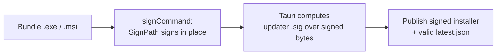

# Windows code signing

Windows installers are Authenticode-signed through [SignPath](https://signpath.io)
during the release build, so the publisher shows as **Dhruv Choudhary** instead of
a blank/unsigned binary.

> **Current certificate is self-signed.** It embeds identity but is **not** chained
> to a trusted CA, so Windows SmartScreen still shows an "Unknown Publisher" warning
> on fresh downloads. To remove that warning, replace the certificate with a
> CA-backed one (e.g. SignPath Foundation's free OSS certificate) — only the
> certificate changes; the pipeline below stays the same.

## How it works

Only the NSIS `.exe` installer is built for Windows — the `.msi` target is
dropped because SignPath's self-signed policy signs PE files but rejects the MSI
(structured storage), and dropping it also avoids the flaky WiX toolchain
download in CI.

Signing is wired through Tauri's `bundle.windows.signCommand`, **not** a separate
post-build step. This ordering is deliberate:



If the installer were signed *after* Tauri generated the updater signature, the
Authenticode signature would change the file's bytes and the `.sig` would no longer
match — auto-update would fail with a hash mismatch. Signing inside `signCommand`
keeps both consistent.

## Moving parts

| Piece | Location |
| --- | --- |
| Sign hook | `scripts/signpath-sign.ps1` (calls `Submit-SigningRequest`) |
| Tauri wiring | `src-tauri/tauri.conf.json` → `bundle.windows.signCommand` |
| CI module install | `.github/workflows/release.yml` → "Install SignPath module" step |
| Auth token | GitHub repo secret `SIGNPATH_API_TOKEN` |

## SignPath coordinates

| Field | Value |
| --- | --- |
| Organization ID | `7948f666-346b-4610-bd68-e09e4d594e6b` |
| Project slug | `Lyric-Overlay` |
| Signing policy slug | `Release` |

These are non-secret identifiers. Only the API token is secret — if it is ever
exposed, regenerate it in **SignPath → API Tokens** and update the
`SIGNPATH_API_TOKEN` repo secret.

## Local test build

A local `tauri build` will invoke the sign hook too. Set the token first, or the
build fails loudly rather than shipping an unsigned installer:

```powershell
Install-Module -Name SignPath -Scope CurrentUser
$env:SIGNPATH_API_TOKEN = '<token>'
npm run tauri:build
```
